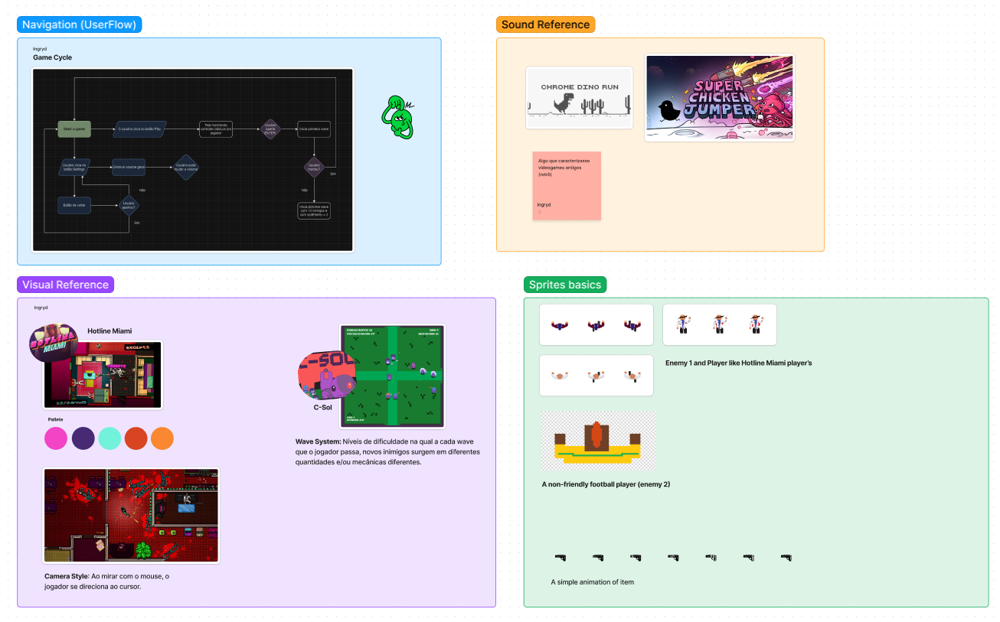

<h1> Hotline ISMD </h1>

Jogo desenvolvido no framework LOVE2D para trabalho da disciplina de Introdução a Sistemas e Mídias Digitais na UFC. 

<h2> Equipe </h2>

|   | <a href="https://github.com/ingrydf12"> Ingryd Duarte</a> |
|   | <a href="https://github.com/Soiten">Renan Araujo</a>  |

<h2> LOVE2D </h2>
O Love2D é um framework multiplataforma que tem <b> Lua </b> como linguagem de script para desenvolvimento de jogos. Ele possui diversas ferramentas que auxiliam a criação de jogos que envolvam física, gráficos, sons, interação multimídia, manipulação de arquivos, consumo de outros frameworks e outros.

### Lua

Lua é uma linguagem de programação interpretada <b> brasileira</b>, de script em alto nível, com tipagem dinâmica e multiparadigma, reflexiva e leve, projetada por Tecgraf da PUC-Rio em 1993 para expandir aplicações em geral, de forma extensível, para prototipagem e para ser embarcada em softwares complexos, como jogos.

Ela é mais conhecida por estar presente em <b> IDEs para jogos</b> como o Roblox Studio, em alguns <b>jogos</b> como Angry Birds e World of Warcraft e em <b>aplicações</b> como o Adobe Lightroom.

<h2> Game Design Concept (GDC) </h2>
Em nossa experiência, fizemos um jogo inspirado em Hotline Miami e Journey of The Prairie King, nos quais o jogador enfrenta hordas de inimigos que aumentam a dificuldade a cada nível.

O jogador é controlado usando o teclado e a direção dos tiros acompanha o mouse.

<h3> Como jogar no meu navegador?</h3>

Clique nesse <a href="">link</a> para ser direcionado ao site contendo o Hotline ISMD.

<h3 align=center>Suport </h3>

